# ARM Assembly

https://developer.arm.com/documentation/dui0473/m/overview-of-the-assembler/about-the-arm-compiler-toolchain-assemblers?utm_source=chatgpt.com

Documenation: https://apt.cs.manchester.ac.uk/ftp/pub/apt/peve/PEVE05/Slides/


## 1. Start

- Overview Computer 

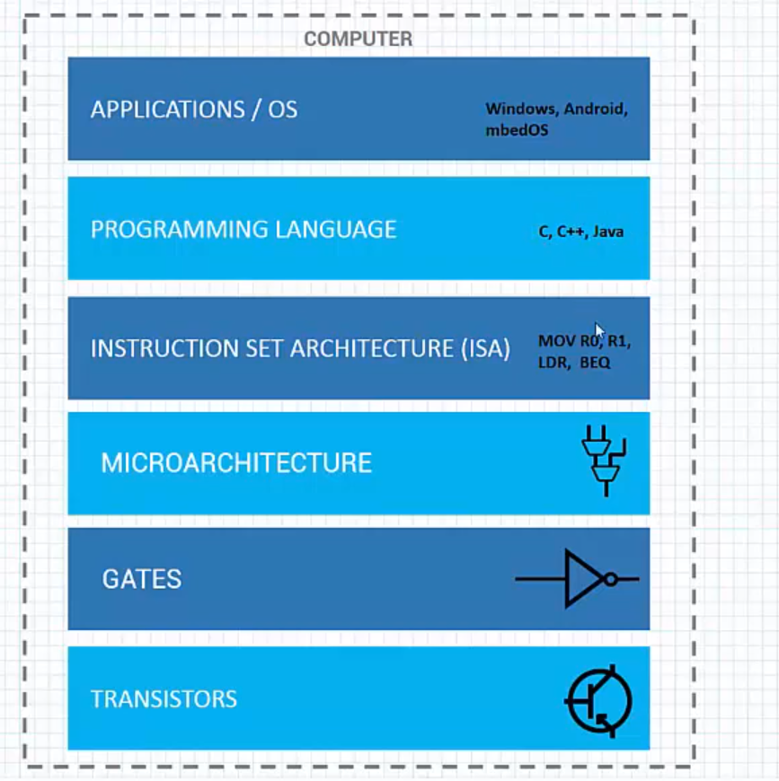

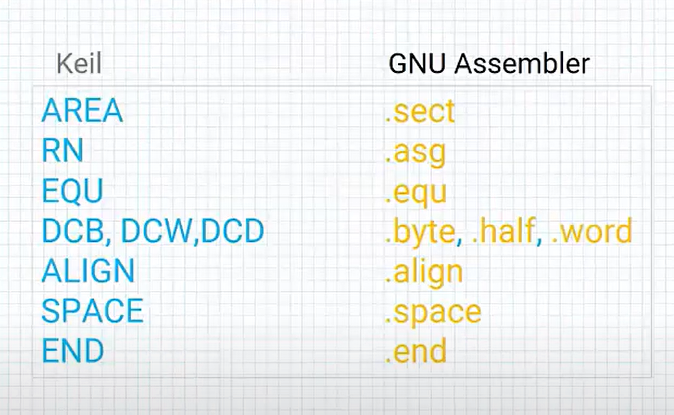

- Section

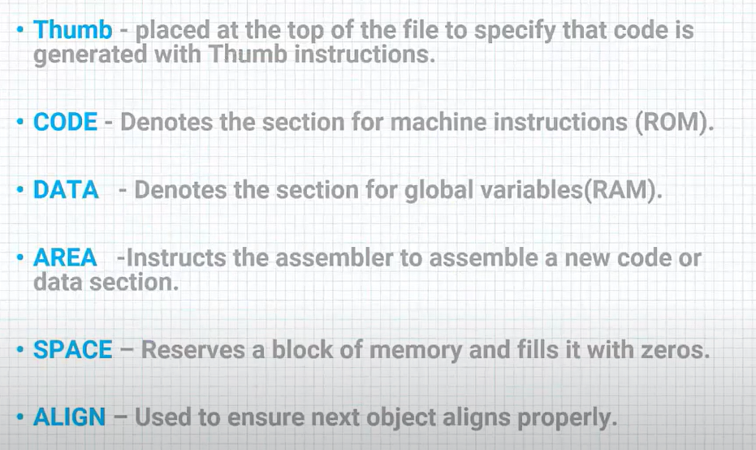

- Lệnh 

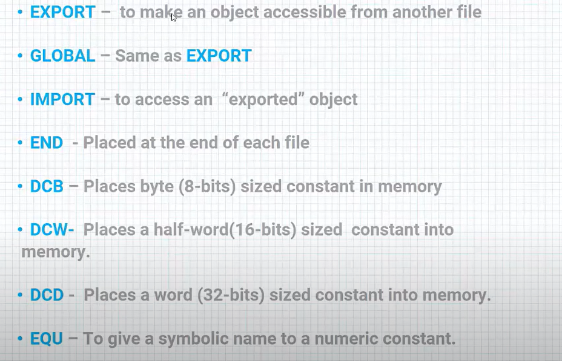

## 1.1. Thanh ghi của vi xử lý ARM-Cotex M4

**Link: https://tapit.vn/co-ban-ve-cau-truc-va-tinh-nang-vi-xu-ly-arm-cortex-mx/** 

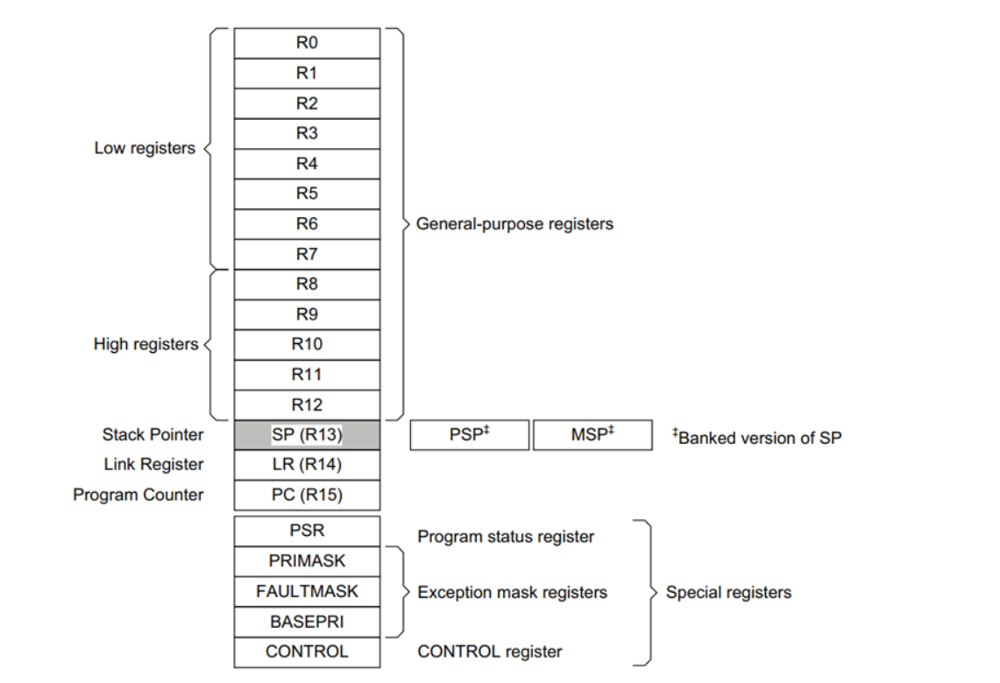

- Không thể giao tiếp với các thanh ghi này bằng ngôn ngữ C -> phải sử dụng ngôn ngữ assembly

## 1.2. First

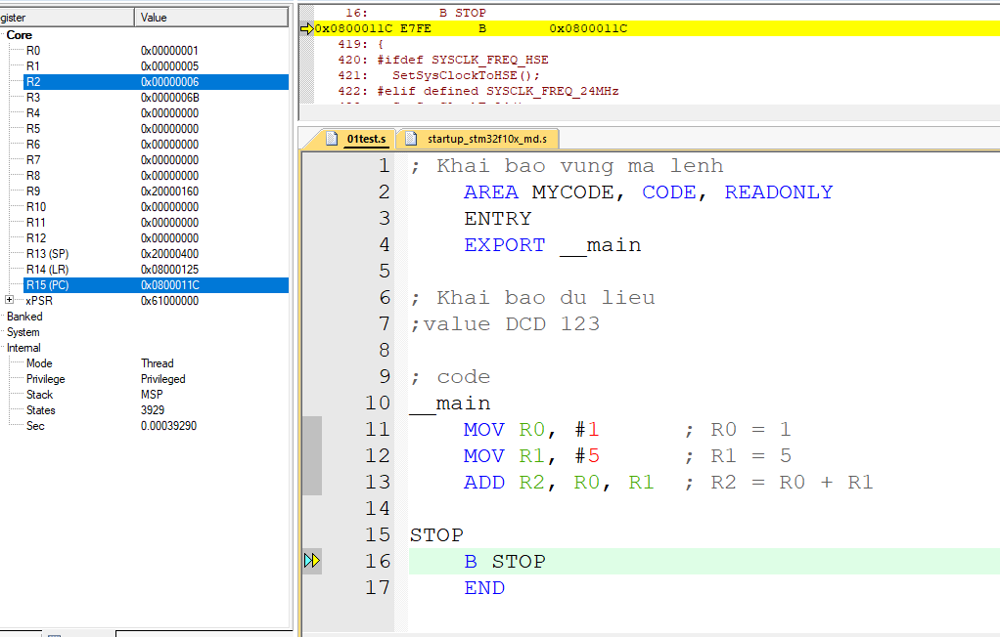

-> thay đổi các thanh ghi R0, R1, R2

- AREA: đánh dấu bắt đầu của 1 section, tên sextion

- ENTRY: đánh dấu lệnh đầu tiên được thực thi

## 2. Kiểu dữ liệu, keyword hay gặp, so sánh GCC và KeilC


### Khai báo KeilC so với GCC

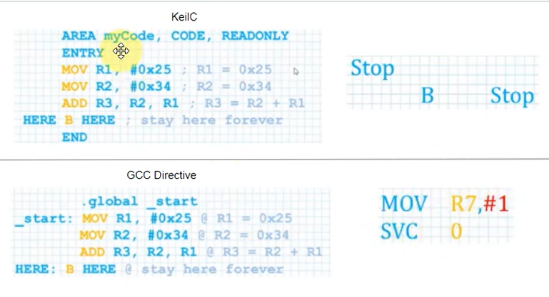

### Keyword hay gặp

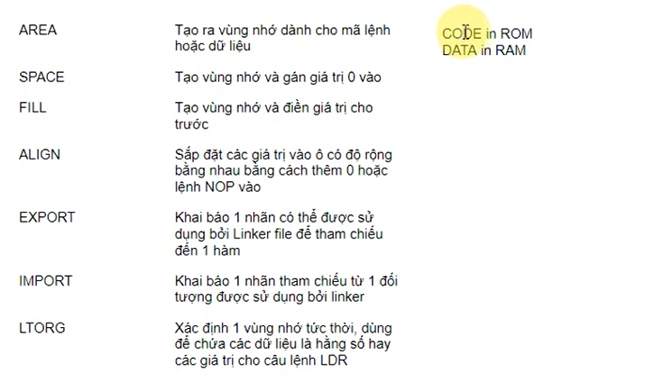

## 3. Lệnh MOV và ADD trong Assembly

- MOV: gán giá trị thanh ghi

- ADD: cộng giá trị thanh ghi

## 4. Khai báo biến, trừ, nhân

```c
BASE    EQU 0x203
Hello   DCB "Hellodcuong", 0
VarByte DCB 2,3,4,5
Var32   DCD 2,100,-100
Var16   DCW 100,300,20
p       SPACE 200
f       FILL 20,0xFF,1
Bin     DCB 2_01010100
A       DCB 0x48           ; ho?c 'H'
CH      DCB 'A'

```
| Tên biến  | Kiểu  | Dữ liệu                 | Dung lượng |
| --------- | ----- | ----------------------- | ---------- |
| `Hello`   | DCB   | Chuỗi `"Hellodcuong\0"` | 12 bytes   |
| `VarByte` | DCB   | 2, 3, 4, 5              | 4 bytes    |
| `Var32`   | DCD   | 2, 100, -100            | 12 bytes   |
| `Var16`   | DCW   | 100, 300, 20            | 6 bytes    |
| `p`       | SPACE | (trống)                 | 200 bytes  |
| `f`       | FILL  | 0xFF x 20               | 20 bytes   |
| `Bin`     | DCB   | 0x54                    | 1 byte     |
| `A`       | DCB   | 0x48 (ASCII 'H')        | 1 byte     |
| `CH`      | DCB   | 0x41 (ASCII 'A')        | 1 byte     |


```c

        AREA MYDATA, DATA, READWRITE
BASE    EQU 0x203
Hello   DCB "Hellodcuong", 0
VarByte DCB 2,3,4,5
Var32   DCD 2,100,-100
Var16   DCW 100,300,20
p       SPACE 200
f       FILL 20,0xFF,1
Bin     DCB 2_01010100
A       DCB 0x48           ; ho?c 'H'
CH      DCB 'A'
        
		AREA MYCODE, CODE, READONLY
        ENTRY
        EXPORT __main

__main
	MOV R1, #10
	MOV R2, #2
	MOV R3, #1
	
	; Tru
	SUB R1, #5   ; R1 = R1 -5
	SUB R1, R2  ; R1 = R1 - R2
	SUBS R1,R2,R3  ; R1 = R2 - R3   SUBS
	
	; Nhaan
	MUL R1,R2  ; R1 = R1 x R2
	MUL R1,R2,R3  ; R1 = R2 x R3
	
	; Nhan to hop
	MLA R1,R2,R3,R4   ; R1 = (R2xR3) + R4
	MLS R1,R2,R3,R4   ; R1 = R4 - (R2xR3)
	RSB R1,R2,#3	; R1 = -R2 + 3
STOP    B STOP
        END


```

## 5. Dịch bit trái, phải (LSL, LSR), ROTATE FOR

- **ROTATE FOR: xoay bit**, tương tự mấy thanh ghi Shift Register trong STM32

```c
; Khai bao vung ma lenh
	AREA MYCODE, CODE, READONLY
	ENTRY
	EXPORT __main
		
; Khai bao du lieu
;value DCD 123
	
; code
__main

	MOV R2,#2
	MOV R1,#1
	
	LSL R1,#2		// R1 << 2
	LSR R2,#1       // R2 >> 1
	
	MOV R1,#2 00101110
	ROR R2,R1,#1 ; Dich phai R1
	
STOP
	B STOP
	END
```

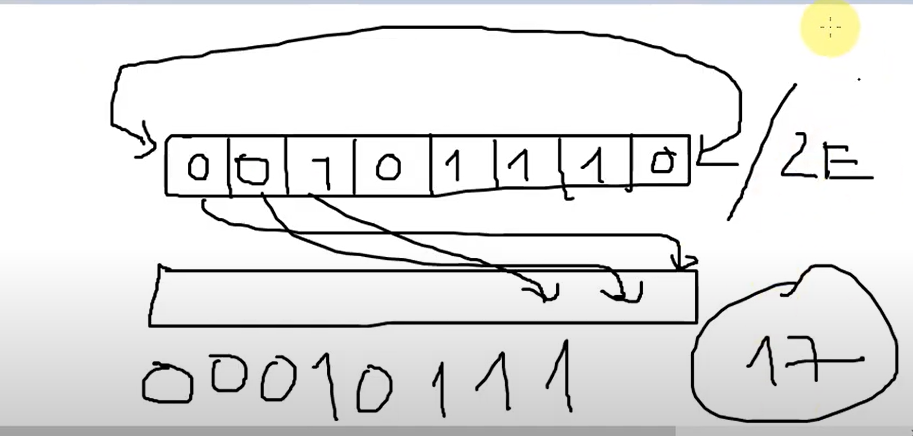

## 6. Clear bit field vaf insert bit field

**Insert Bit Field**

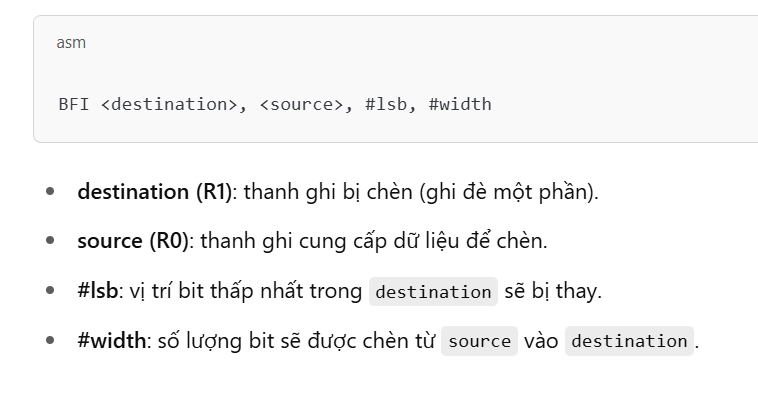

```c
LDR R0, =0x12341234     ; R0 = 0x12341234 = 0001 0010 0011 0100 0001 0010 0011 0100
LDR R1, =0xFFFFFFFF     ; R1 = 0xFFFFFFFF = 1111 1111 1111 1111 1111 1111 1111 1111

BFI R1, R0, #4, #8
```
- Lệnh này có nghĩa: lấy 8 bit thấp nhất của R0 (tức là 0x34 = 00110100), rồi chép vào vị trí từ bit 4 đến bit 11 của R1.

**Clear Bit Field BFC**

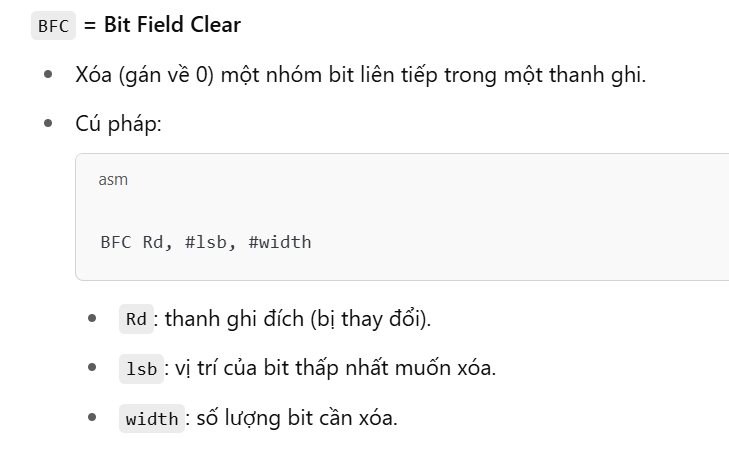
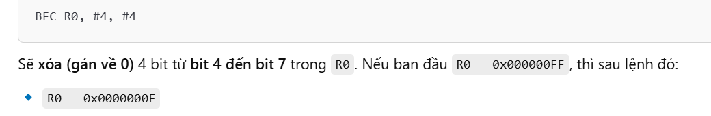

## 7. Bit wise trong ARM Assembly

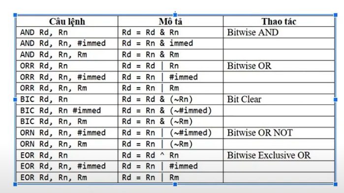

## 8. Load LDR & Store STR

### Cách dữ liệu 32-bit (word) được lưu trữ trong bộ nhớ theo kiểu Little Endian
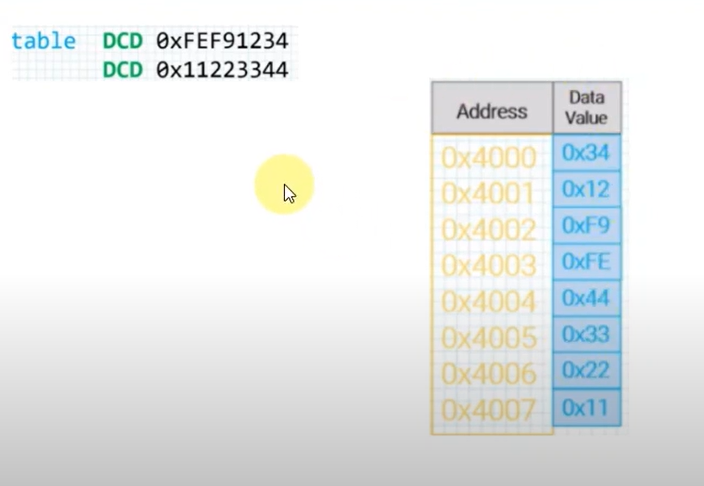

- Ngược lại với **Big Endian**, thứ tự byte little endian lưu trữ LSB ở địa chỉ nhỏ nhất và MSB ở địa chỉ lớn nhất. Điều này có nghĩa là thứ tự byte là từ phải sang trái, với byte ít quan trọng nhất trước.

### LDR & STR, load register & store register 
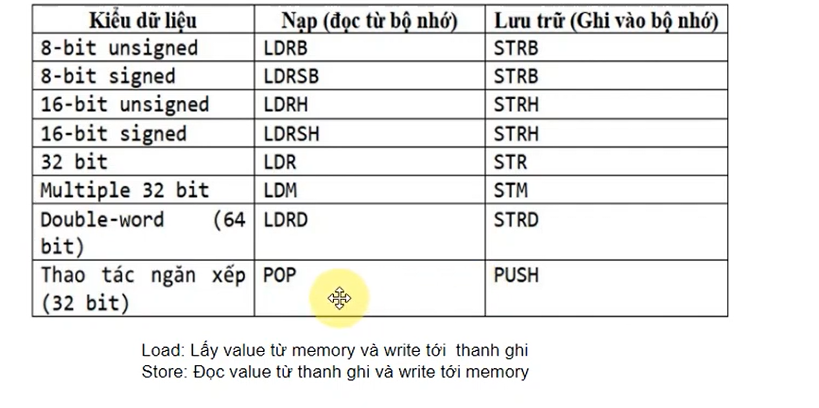

### STR: lưu giá trị từ một thanh ghi vào bộ nhớ

`STR <Nguồn>, [<Đích>]
`

```c
MOV R0, #0x12345678   ; Gán giá trị vào R0
LDR R1, =0x20000000   ; R1 trỏ tới địa chỉ bộ nhớ
STR R0, [R1]          ; Lưu giá trị trong R0 vào địa chỉ 0x20000000

```

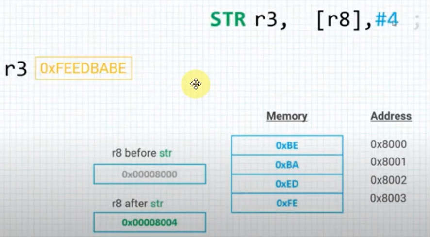

### LDR: đẩy giá trị của vùng nhớ vào thanh ghi

`LDRH r11, [r0]`: lưu 16 bit của vùng nhớ vào thanh ghi

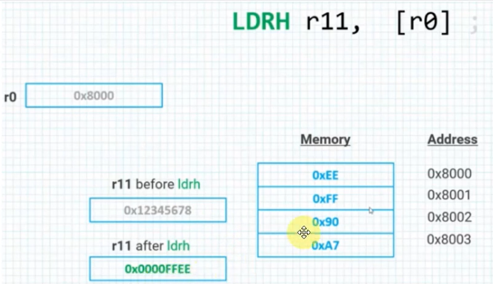

```c

        AREA MYCODE, CODE, READONLY
        ENTRY
        EXPORT __main
			
; Khai bao du lieu
st      DCD 1, 2, 3, 4, 5

; Code
__main	
		LDR R1, st
		LDR R1, =st
        LDR R3, =4
        LDR R2, [R1]
        LDR R2, [R1, R3]
        LDR R2, [R1, #4]
        LDR R8, =0x8000300

        LDR R0, =0xABCDABCD
        LDR R1, =0x2000100
        STR R0, [R1]

STOP    B STOP
        END

```

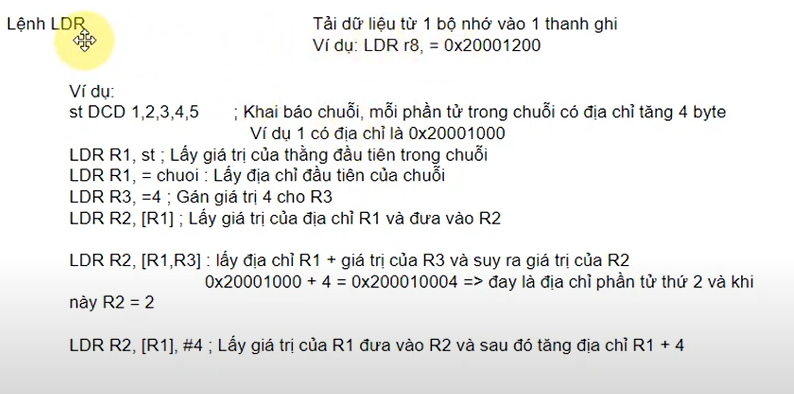

### Ví dụ STR: lưu giá trị thanh ghi vào RAM

### 1. Cộng trước lưu sau

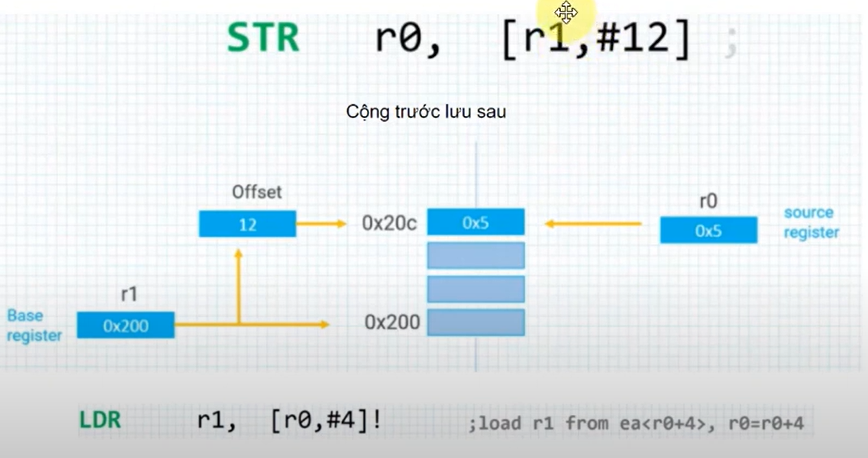

- r0: nguồn dữ liệu (giá trị sẽ được ghi)

- [r1, #12]: địa chỉ đích là nội dung thanh ghi cộng thêm 12 byte offset, 0x200 + 0xC = 0x20C

### 2. Lưu trước cộng sau
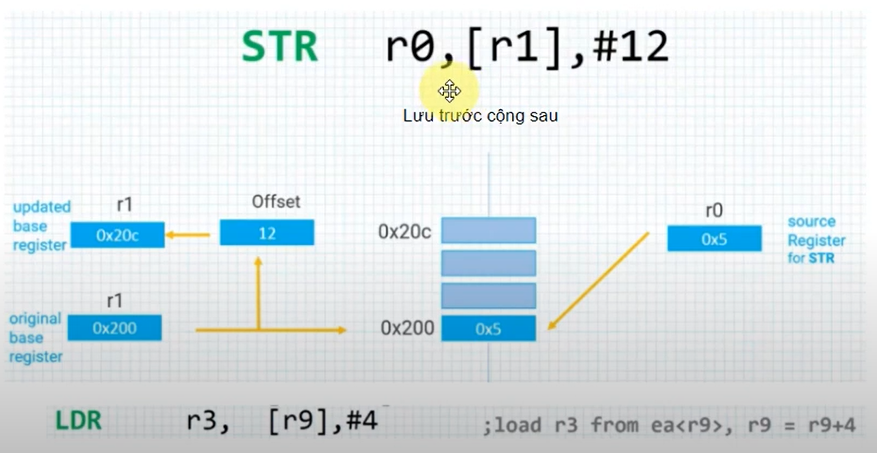

```c
        LDR R0, =0xABCDABCD
        LDR R1, =0x2000100
        STR R0, [R1]
```

- Lưu giá trị của thanh ghi R0 vào vùng nhớ R1

## 9. Compare CMP, Label, Branch B, Branch And Link BL, Branch eXchange BX

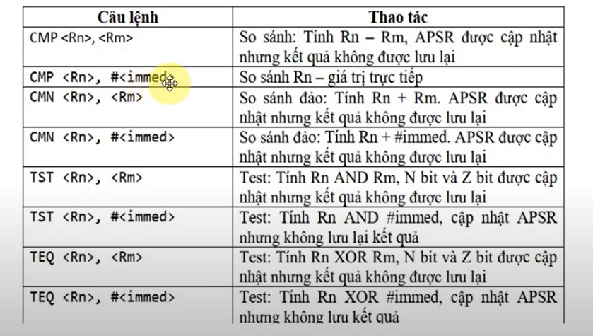

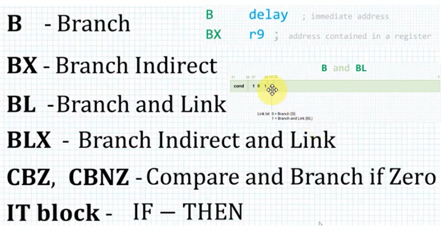

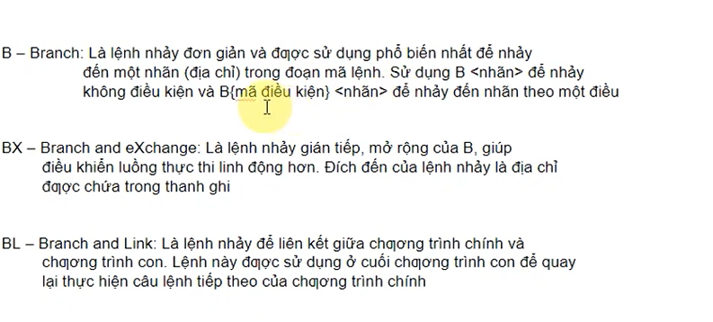
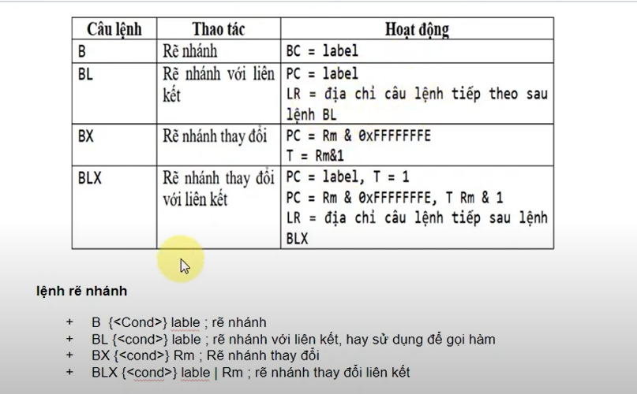

### Check các cờ tại thanh ghi PSR
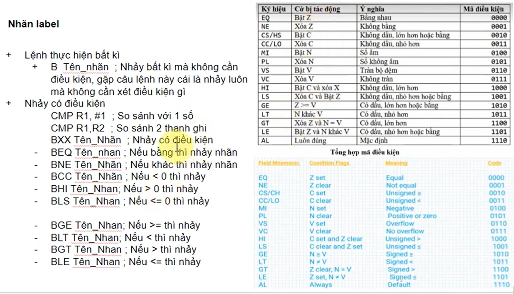

### BEQ và BNE

```c
; Khai bao vung ma lenh
	AREA MYCODE, CODE, READONLY
	ENTRY
	EXPORT __main
		
; Khai bao du lieu
;value DCD 123
	
; code
__main
	
	MOV R1,#1
	MOV R0,#0
	MOV R2,#1
	
	CMP R0,R2
	BEQ Bangnhau
	BNE Khaunhau
	MOV R2,#99

Bangnhau
	MOV R2,#100
	
Khacnhau
	MOV R2,#90
	
STOP
	B STOP
	END
```

### BX: nhảy tới địa chỉ thanh ghi để làm việc

## 10. Lệnh If trong ARM Assembly

- Sử dụng phối hợp giữa **Branch & Compare**

```c
; Khai bao vung ma lenh
	AREA MYCODE, CODE, READONLY
	ENTRY
	EXPORT __main

; Khai bao du lieu
N EQU 11
M DCD 9
; Code
__main
	LDR R0,=N
	LDR R1,=M
	LDR R2,[R1]
	CMP R2,#10
	
	BLS BeHonBang   ; R0 <= 10
	B NguocLai
	
BeHonBang
	MOV R10,#10
	B Next
NguocLai
	MOV R10,#9
	B Next
Next
	MOV R10,#1

STOP 
	B STOP
	END
```	

- Lưu ý ghi sử dụng **LDR**

	- LDR R0,=N -> OK, Lấy được giá trị từ bộ nhớ (N) vào thanh ghi R0 vì N là biến hằng

	- Đối với M là biến DCD, cần phải làm như trên

## 11. Lệnh Switch Case

- Tương tự như if, sử dụng **BEQ: nhãn nhảy tới nếu bằng** và **B**, **Compare**

```c
; Khai bao vung ma lenh
	AREA MYCODE, CODE, READONLY
	ENTRY
	EXPORT __main

; Khai bao du lieu

; Code
__main
	MOV R1,#10
	
	CMP R1,#5
	BEQ Case1   ; R1 == 5
	CMP R1,#6
	BEQ Case2   ; R1 == 6
	CMP R1,#7
	BEQ Case3   ; R1 == 7
	B Next		; Default
	
Case3
	MOV R10,#7
	B Next
Case2
	MOV R10,#6
	B Next
Case1
	MOV R10,#5
	B Next
	
Next
	MOV R10,#1
	
STOP 
	B STOP
	END
	
```

## 12. Lệnh For loop

```c
; Khai bao vung ma lenh
	AREA MYCODE, CODE, READONLY
	ENTRY
	EXPORT __main

; Khai bao du lieu

; Code
__main

	MOV R1,#1    ; i = 1

FORTHO
	CMP R1,#10    ; i < 10 ?
	BGE DONE      ;  if I >= 10 DONE
	ADD R1,R1,#1
	B FORTHO
	
DONE
	MOV R1,#100
	
STOP 
	B STOP
	END
	
```
- Sử dụng **compare BGE và B**

## 13. Nhóm lệnh có điều kiện & Flag

```c
	MOV R1,#1
	MOV R2,#2
	
	CMP R1,#1
	ADDEQ R0,R1,R2
	
	CMP R1,R2
	ADDGT R0,R1,R2  ; R1 >= R2   R0 = R1+R2
	SUBLE R0,R2,R1	; R1 < R2    R0 = R2 -R1
```

- Lệnh **ADDEQ: cộng... nếu lệnh so sánh ở trên bằng nhau**

- Lệnh **ADDGT: cộng... nếu lớn hơn hoặc =**

- lệnh **SUBLE: trừ.... nếu bé hơn**

```c
	; If( R0 == 1 || R0 == 2 ) R1 =R1+5
	MOV R0,#2
	
	TEQ R0,#1
	TEQNE R0,#2
	ADDEQ R1,R1,#5
```

- Giải thích **TEQ & TEQNE** để làm câu lệnh giả if 2 điều kiện

```c
MOV R0, #2      ; R0 = 2
TEQ R0, #1      ; so sánh R0 với 1 → Z = 0
TEQNE R0, #2    ; chỉ thực thi nếu Z == 0 → sẽ được thực thi
                ; so sánh R0 với 2 → Z = 1
ADDEQ R1, R1, #5 ; nếu Z == 1 thì R1 += 5 → sẽ được thực thi

```

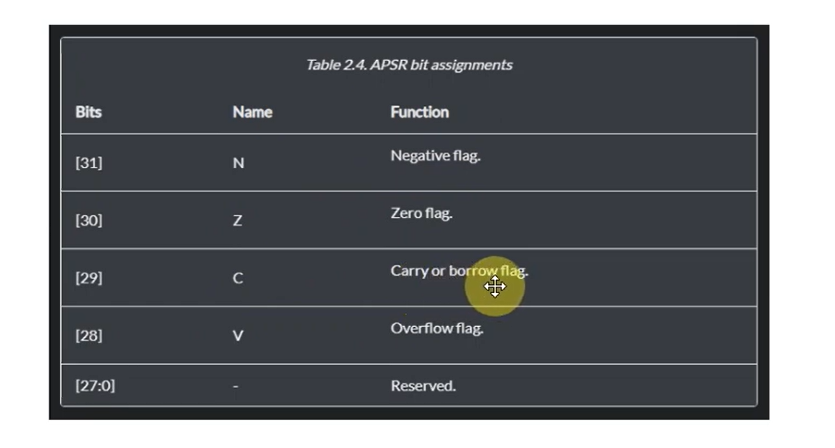

### Overflow Flag

- Các **bit cờ trong thanh ghi trạng thái APSR (Application Program Status Register)** của ARM. Các cờ này **phản ánh kết quả của các phép toán số học và logic.**

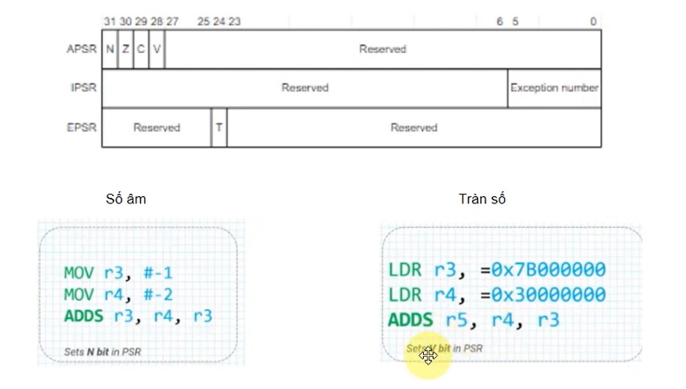

#### Cờ Negative Flag

- Được set (N=1) nếu kết quả là số âm (bit MSB = 1).

```c
MOV R0, #-5      ; R0 = 0xFFFFFFFB
CMP R0, #0       ; So sánh -5 với 0 → -5 < 0 → N = 1
```

#### Cờ Zero Flag

- Được set (Z=1) nếu kết quả phép toán là 0.

```c
MOV R0, #5
SUBS R0, R0, #5  ; 5 - 5 = 0 → Z = 1
```
#### Cờ C (Carry/ Borrow Flag)

- Trong phép cộng: C = 1 nếu có dư (carry out khỏi MSB).

- Trong phép trừ: C = 0 nếu có mượn (borrow).

```c
; Phép cộng gây dư:
MOV R0, #0xFFFFFFFF
ADDS R0, R0, #1   ; 0xFFFFFFFF + 1 = 0x00000000 → C = 1 (dư 1 bit)

; Phép trừ có mượn:
MOV R0, #3
SUBS R0, R0, #5   ; 3 - 5 = -2 → C = 0 (có mượn)
```

#### Cờ V (Overlow Flag)

- Được set (V=1) nếu phép cộng/trừ tràn số có dấu (sign overflow).

```c
; Tràn dương:
MOV R0, #0x7FFFFFFF   ; số dương lớn nhất 32-bit
ADDS R0, R0, #1       ; 0x7FFFFFFF + 1 = 0x80000000 → V = 1

; Tràn âm:
MOV R0, #0x80000000   ; số âm lớn nhất (int32: -2147483648)
SUBS R0, R0, #1       ; -2147483648 - 1 = tràn → V = 1
```

## 14. Tính tổng các số bé hơn = N

```c
; Khai bao vung ma lenh
	AREA MYCODE, CODE, READONLY
	ENTRY
	EXPORT __main

; Khai bao du lieu
N EQU 10
; Code
__main
	MOV R0,#0  ; Tong
	LDR R1,=N
	
TinhTong	
	ADD R0,R0,R1  ; R0= R0 + R1
	SUBS R1,R1,#1 ; R1 = R1 -1
	CMP R1,#0
	BGT TinhTong   ; R1 > 0 Nhay

STOP 
	B STOP
	END
```

## 15. Tổng các số chẵn bé hơn N

```c
; Khai bao vung ma lenh
	AREA MYCODE, CODE, READONLY
	ENTRY
	EXPORT __main

; Khai bao du lieu
N DCD 8
; Code
__main
	MOV R0,#0  ; Bien Tang 2
	LDR R1,N
	MOV R2, #0  ; Tong Cac So Chan
	
LoopSoChan
	CMP R1,R0
	BHI BenDuoi
	B Thoat

BenDuoi
	ADD R2,R2,R0   ; R2= R2 + R0
	ADD R0,R0,#2
	B LoopSoChan
	
Thoat

STOP 
	B STOP
	END
	
```