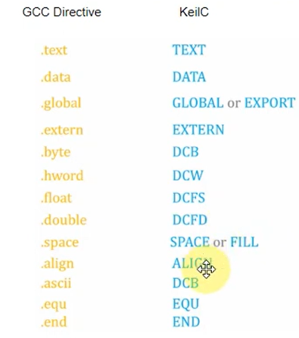

# ARM Assembly

https://developer.arm.com/documentation/dui0473/m/overview-of-the-assembler/about-the-arm-compiler-toolchain-assemblers?utm_source=chatgpt.com

Documenation: https://apt.cs.manchester.ac.uk/ftp/pub/apt/peve/PEVE05/Slides/

## 1. Start

- Overview Computer 

- Section

- Lệnh 

## 1.1. Thanh ghi của vi xử lý ARM-Cotex M4

**Link: https://tapit.vn/co-ban-ve-cau-truc-va-tinh-nang-vi-xu-ly-arm-cortex-mx/** 

- Không thể giao tiếp với các thanh ghi này bằng ngôn ngữ C -> phải sử dụng ngôn ngữ assembly

## 1.2. First

-> thay đổi các thanh ghi R0, R1, R2

- AREA: đánh dấu bắt đầu của 1 section, tên sextion

- ENTRY: đánh dấu lệnh đầu tiên được thực thi

## 2. Kiểu dữ liệu, keyword hay gặp, so sánh GCC và KeilC

### Khai báo KeilC so với GCC

### Keyword hay gặp

## 3. Lệnh MOV và ADD trong Assembly

